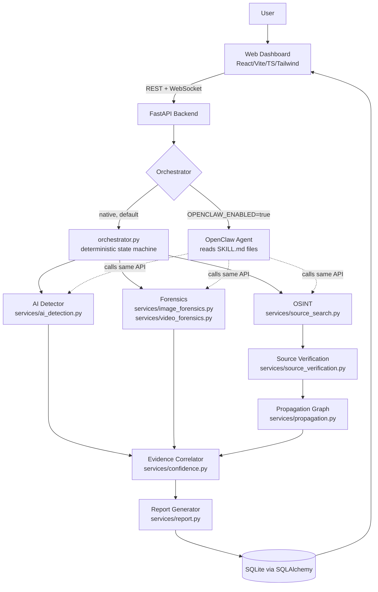

# Architecture

## Overview



## Data model

```
investigations
    |
    +--- media_assets        (1:1 — hash, metadata, perceptual hashes)
    |
    +--- forensic_results    (1:1 — ELA/noise/resampling/compression)
    |
    +--- ai_detections       (1:1 — classification/probability/signals)
    |
    +--- sources             (1:N — ranked OSINT candidates)
    |
    +--- propagation_edges   (1:N — graph edges between sources)
    |
    +--- investigation_events (1:N — chain-of-custody / audit log)
    |
    +--- report              (1:1 — final structured JSON report)
```

See `backend/app/models/investigation.py` for the full SQLAlchemy schema.

## Investigation state machine

```
UPLOADED → HASHING → METADATA_ANALYSIS → AI_ANALYSIS → FORENSIC_ANALYSIS →
ORIGIN_SEARCH → SOURCE_VERIFICATION → PROPAGATION_ANALYSIS → CORRELATION →
REPORT_GENERATION → COMPLETED
                                    ↘ FAILED / PARTIAL (on error)
```

Every transition is logged to `investigation_events` with an agent name,
action, and timestamp — the chain-of-custody / audit log shown in the
Evidence tab.

## Why two orchestration paths

1. **Native (`orchestrator.py`)** — runs by default, no external process.
   Mirrors the OpenClaw skills' documented branching logic in plain Python,
   so the platform is fully runnable and testable (CI, offline demo)
   without depending on a second long-running agent process.
2. **OpenClaw-driven** — a real `openclaw` agent, pointed at the
   `openclaw/` workspace, calls the exact same REST endpoints as tools,
   using the seven `SKILL.md` files for genuine LLM reasoning on the parts
   that benefit from it (OSINT query reformulation, source credibility
   judgment calls, CAPTCHA/paywall handling).

Both paths call into the same deterministic services
(`image_forensics.py`, `ai_detection.py`, `source_verification.py`, etc.) —
OpenClaw orchestrates and reasons; it never does pixel-level detection
itself.

## Evidence confidence model

`services/confidence.py` computes the overall score as a documented,
weighted combination — not a blind average:

| Signal | Weight |
|---|---|
| AI-detection probability | 40% |
| Forensic evidence strength | 30% |
| Best source credibility | 15% |
| Best media similarity | 15% |

Mapped to `HIGH` / `MEDIUM` / `LOW` / `INCONCLUSIVE`.

## Source confidence model

`services/source_verification.py` scores each OSINT candidate from a base of
0.5, adjusted by documented positive/negative factors (publication date
presence, similarity strength, independence vs. repost signals, screenshot-
of-post detection, "published after viral" detection). Ranking sorts by
`(confidence desc, publication_date asc)` so a highly-credible slightly-later
source can outrank a low-credibility "oldest" repost screenshot.

## Frontend structure

```
frontend/src/
├── App.tsx                 sidebar nav + routes
├── pages/
│   ├── Dashboard.tsx        stats + recent investigations
│   ├── Upload.tsx           drag-and-drop + demo seed button
│   └── InvestigationPage.tsx tabs: Overview/AI Detection/Forensics/
│                             Evidence/Sources/Timeline/Propagation/Report
├── components/
│   ├── StatusPipeline.tsx   live WebSocket-driven progress pipeline
│   ├── PropagationGraph.tsx SVG node/edge graph (no heavy graph-lib dep)
│   ├── Timeline.tsx         chronological source timeline
│   └── ui.tsx               VerdictBadge, ScoreBar, ConfidencePill, Card
├── services/api.ts          typed fetch client + WebSocket helper
└── types/index.ts           shared TypeScript interfaces mirroring the API
```
