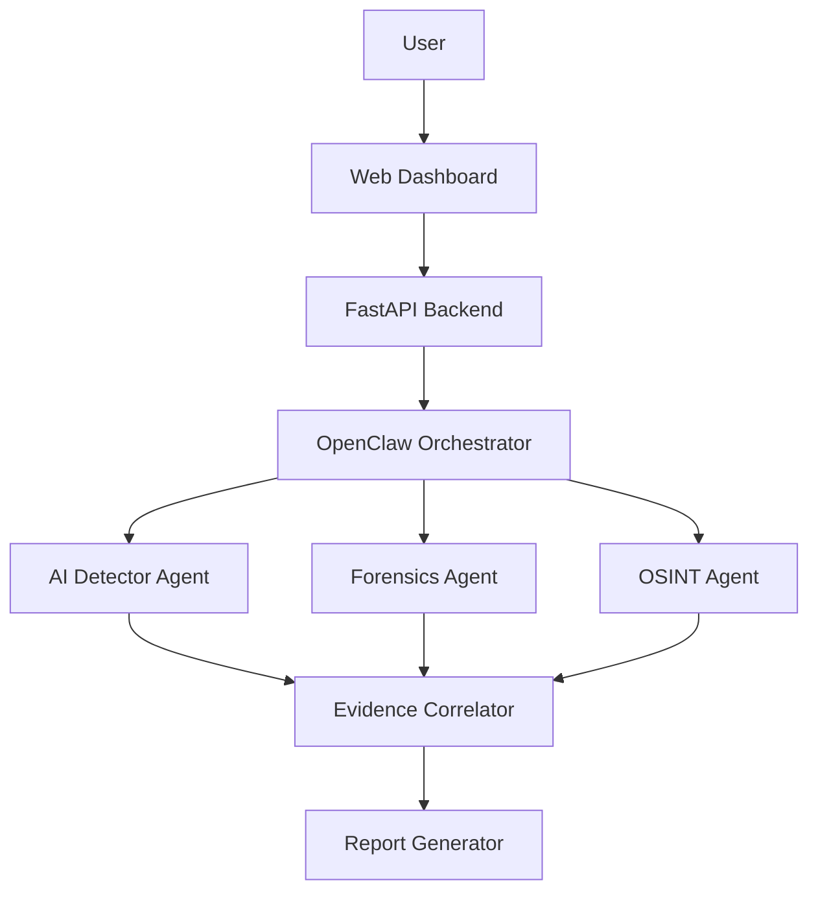

# AI Media Forensics & Origin Tracing Platform

An autonomous digital-media investigation platform. Upload a suspicious
image or video and it is hashed, forensically analyzed, AI-detection
scored, traced across the open web for its earliest credible occurrence,
and correlated into a final report — orchestrated as an investigation, not
run through a single fake-image classifier.

```
UPLOAD MEDIA → PRESERVE EVIDENCE → ANALYZE → DETECT AI MANIPULATION →
FORENSIC ANALYSIS → SEARCH WEB/SOCIAL SOURCES → FIND EARLIER OCCURRENCES →
COMPARE MEDIA → BUILD SOURCE TIMELINE → TRACE PROPAGATION →
CORRELATE EVIDENCE → GENERATE FORENSIC REPORT
```

## 1. Problem

Misinformation, impersonation, cyber fraud, and digital-evidence tampering
increasingly rely on AI-generated or AI-altered images and video. A binary
"is this AI or not" classifier answers only part of the question a real
investigator needs answered: **where did this come from, and how has it
spread?**

## 2. Solution

A platform where an autonomous investigation/orchestration layer
(**OpenClaw**) coordinates specialized, deterministic tools:

- An **AI/manipulation detector** (pluggable interface; demo heuristic
  detector ships by default, swap in a real model without touching the rest
  of the pipeline)
- A **forensic analyzer** (ELA, noise consistency, resampling, compression,
  metadata — real signal-processing, not simulated)
- An **OSINT/origin investigator** (web search, perceptual-hash comparison,
  source credibility scoring, propagation graphing)

...combined by a documented, non-averaging **evidence-correlation model**
into one final, honestly-hedged verdict.

## 3. Why OpenClaw

OpenClaw (`openclaw` on npm — a self-hosted, multi-channel AI agent gateway
that discovers capabilities via `SKILL.md` files) is the natural fit for the
part of this problem that isn't deterministic: OSINT reasoning. Reformulating
a failed search query, judging whether a candidate source looks like a
repost, deciding when a paywall/CAPTCHA means "stop and flag for manual
review" — these are judgment calls, not fixed rules. OpenClaw is the
orchestration/investigation layer; it is never the thing doing pixel-level
detection. See `openclaw/README.md` for exactly how the two integration
modes (native orchestrator vs. real OpenClaw agent) work and why both ship.

## 4. Architecture

```
                    USER
                     |
                     v
              WEB DASHBOARD (React/Vite/TS/Tailwind)
                     |
                     v
              FASTAPI BACKEND
                     |
                     v
              OPENCLAW AGENT / NATIVE ORCHESTRATOR
                     |
       +-------------+-------------+
       |             |             |
       v             v             v
  AI DETECTOR    FORENSICS       OSINT
     AGENT         AGENT         AGENT
       |             |             |
       +-------------+-------------+
                     |
                     v
              EVIDENCE CORRELATOR
                     |
                     v
              REPORT GENERATOR
```



## 5. Agent workflow

Implemented identically by both the native orchestrator
(`backend/app/services/orchestrator.py`) and the seven OpenClaw skills
(`openclaw/skills/*/SKILL.md`):

`UPLOADED → HASHING → METADATA_ANALYSIS → AI_ANALYSIS → FORENSIC_ANALYSIS →
ORIGIN_SEARCH → SOURCE_VERIFICATION → PROPAGATION_ANALYSIS → CORRELATION →
REPORT_GENERATION → COMPLETED`, with branching (broaden a search that
returns nothing; stop expanding once a source clears the confidence
threshold; degrade gracefully when a source is inaccessible) mirrored in
both places.

## 6. AI detection

`backend/app/services/ai_detection.py` defines `MediaDetector`, a pluggable
interface. The shipped `DemoHeuristicDetector` combines real forensic
signals (ELA/noise/resampling) into a transparent, reproducible score — it
is labeled `is_demo: true` everywhere it's surfaced and is never presented
as a validated deepfake classifier. Swap in a Hugging Face/PyTorch model by
implementing the same interface and branching in `get_detector()`.

## 7. Forensic pipeline

Real, local, deterministic signal processing — no external calls:
- SHA-256 evidence hashing
- EXIF/ffprobe metadata extraction (GPS flagged present/absent, never
  exposed raw by default)
- Error Level Analysis (recompression diff), noise-consistency analysis
  (tile-variance), resampling/interpolation detection (FFT peak ratio),
  JPEG compression/quantization inspection
- Video: sampled-frame extraction (not every frame) + the same image
  pipeline per frame

## 8. Origin tracing

`backend/app/services/source_search.py` defines `SourceSearchProvider`.
`DemoSourceProvider` (default, offline) returns clearly-labeled mock
candidates so the whole pipeline can be demoed with zero API keys.
`BraveSourceProvider` performs real web search via the Brave Search API when
`BRAVE_API_KEY` is set — explicitly **not** presented as true reverse-image
search, since none is wired by default (see Limitations).

## 9. Social propagation tracing

Ranked sources are turned into a `source → post/article` graph
(`services/propagation.py`), rendered as an interactive SVG graph and a
chronological timeline in the frontend.

## 10. Technology stack

- **Frontend**: React, Vite, TypeScript, Tailwind CSS, Recharts, custom SVG
  propagation graph
- **Backend**: Python, FastAPI, Pydantic, Uvicorn, SQLAlchemy, SQLite
- **Media/forensics**: Pillow, NumPy, OpenCV (available, forensic math also
  hand-rolled for transparency), imagehash, ffmpeg/ffprobe
- **Agent**: OpenClaw (`openclaw` npm package), 7 custom `SKILL.md` skills

## 11. Installation

```bash
git clone <this-repo>
cd media-forensics
cp .env.example .env
./run.sh
```

This installs Python deps into a venv, npm deps for the frontend, and starts
both dev servers (`:8000` backend, `:5173` frontend). See `SETUP.md` for
details, Docker instructions, and OpenClaw agent setup.

## 12. Configuration

All settings are environment variables — see `.env.example`. Nothing is
hardcoded; no secret is ever committed.

## 13. Demo mode

`DEMO_MODE=true` (the default): the AI-detection and forensic pipeline run
as real computation on whatever file you upload; only the OSINT layer uses
the labeled demo provider. Click **"Run Demo Investigation"** on the Upload
page for a one-click, zero-setup, fully-offline sample investigation
(`POST /api/demo/seed`) — see `DEMO.md`.

## 14. Real mode

`DEMO_MODE=false` with `BRAVE_API_KEY` set enables real web search for
origin tracing. Point a real `openclaw` agent at `openclaw/` with
`OPENCLAW_ENABLED=true` to have it drive investigations using
`web_search`/`web_fetch`/`browser`/`x_search` tools per the skills'
documented judgment calls, instead of the native orchestrator's fixed rules.

## 15. Limitations

- No true reverse-image-search API is wired by default; origin tracing uses
  text/web similarity search, and the platform says so explicitly rather
  than implying otherwise.
- The demo AI detector is a heuristic, not a trained/validated
  deepfake-classification model.
- Perceptual-hash similarity establishes relatedness, not proof of
  ownership or origin; the oldest search result found is never assumed to
  be "the original."
- The Docker Compose frontend serves a static production build without a
  reverse proxy for `/api/*` — for the smoothest experience (including the
  Vite dev proxy and WebSocket progress), use `./run.sh` rather than
  `docker compose up` unless you add your own reverse proxy in front of both
  containers.
- exiftool is not assumed to be installed; Pillow's EXIF reader is the
  default, with an exiftool-based path used automatically if it's present.

## 16. Security

- Least-privilege tool scoping per OpenClaw skill (see `openclaw/README.md`).
- Untrusted webpage content is never treated as an instruction (prompt-
  injection guardrails documented per-skill).
- No API keys, environment variables, or local paths are ever exposed to
  external pages or included in generated reports.
- CAPTCHA/login/2FA/private-account/paywall restrictions are never bypassed;
  the platform records "Source inaccessible — manual verification required"
  instead.

## 17. Future work

- Wire a real trained deepfake-detection model behind `MediaDetector`.
- Add a genuine reverse-image-search provider (e.g. an approved vendor API).
- Persist investigations to Postgres for multi-user/production use.
- Add authenticated multi-tenant access and role-based evidence handling for
  real chain-of-custody use cases.
